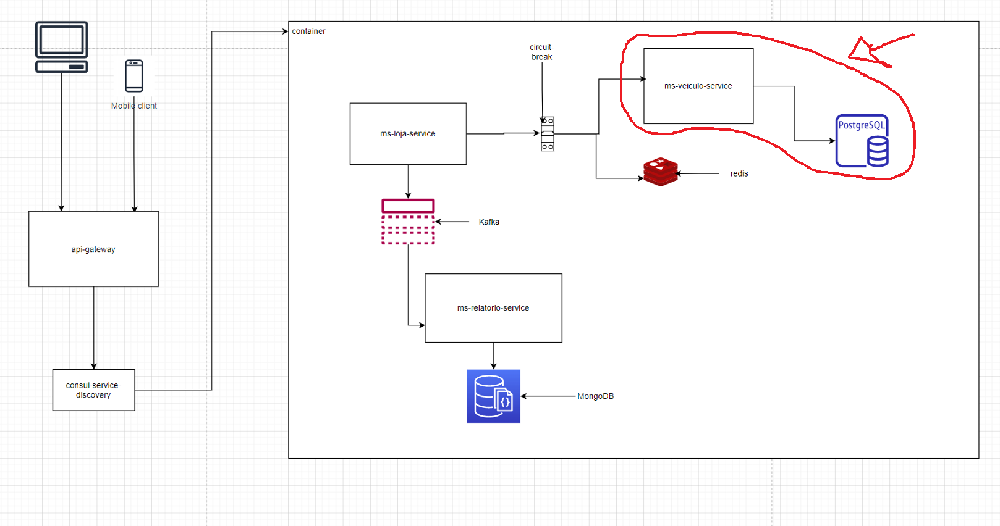

## Micronaut 3.8.3 Documentation

- [User Guide](https://docs.micronaut.io/3.8.3/guide/index.html)
- [API Reference](https://docs.micronaut.io/3.8.3/api/index.html)
- [Configuration Reference](https://docs.micronaut.io/3.8.3/guide/configurationreference.html)
- [Micronaut Guides](https://guides.micronaut.io/index.html)
---

- [Shadow Gradle Plugin](https://plugins.gradle.org/plugin/com.github.johnrengelman.shadow)
## Feature jdbc-hikari documentation

- [Micronaut Hikari JDBC Connection Pool documentation](https://micronaut-projects.github.io/micronaut-sql/latest/guide/index.html#jdbc)

## Feature test-resources documentation

- [Micronaut Test Resources documentation](https://micronaut-projects.github.io/micronaut-test-resources/latest/guide/)

## Feature http-client documentation

- [Micronaut HTTP Client documentation](https://docs.micronaut.io/latest/guide/index.html#httpClient)

## MS veiculo-service
* microsserviço responsavel pelo cadastro de um veiculo, onde será mostrado o desenvolvimento de uma aplicação de vendas de veículos seguindo vários padrões da arquitetura de microsserviços

## Setup Projeto

* Micronaut Application
* Java 11
* Kotlin
* Gradle
* Junit
* JPA
* Postgres

## Desenho Aplicação

